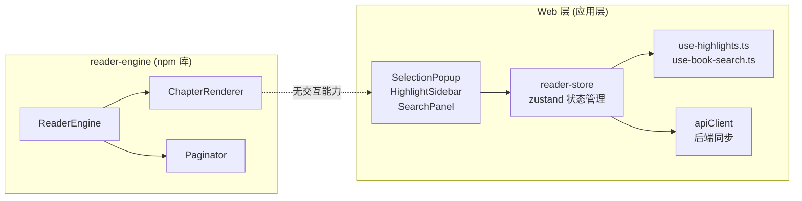
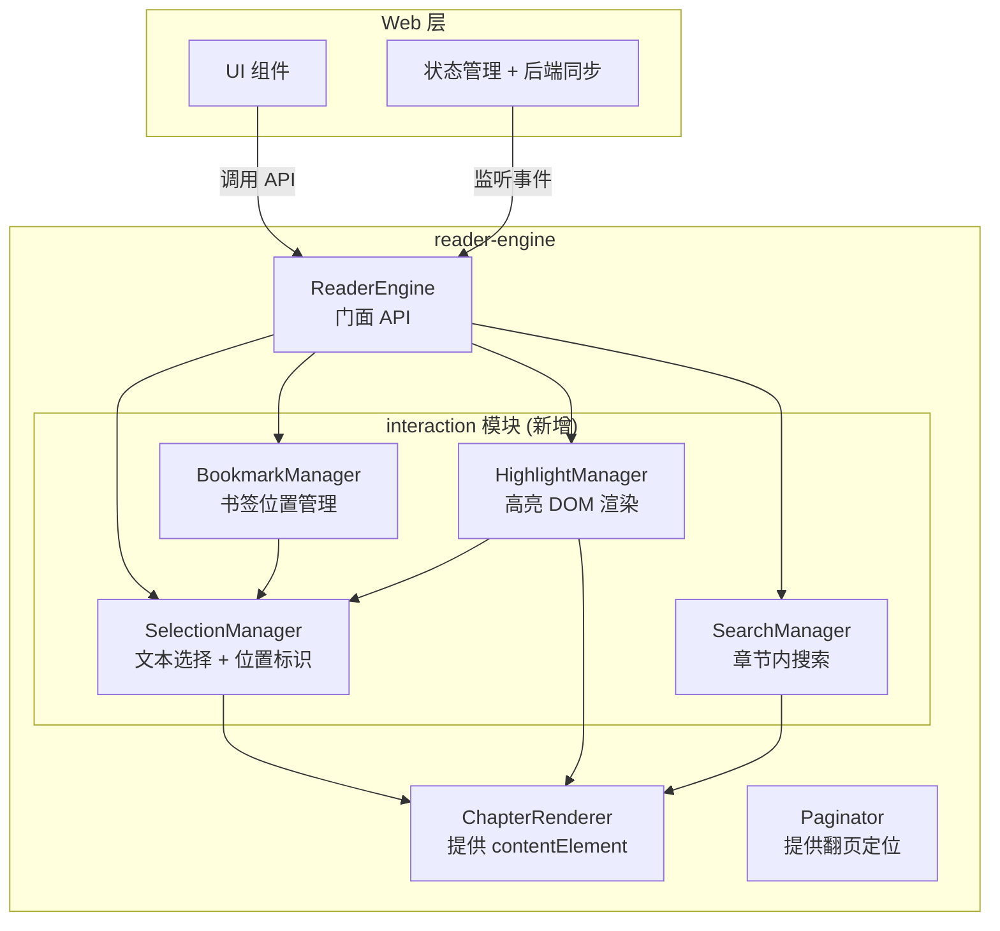
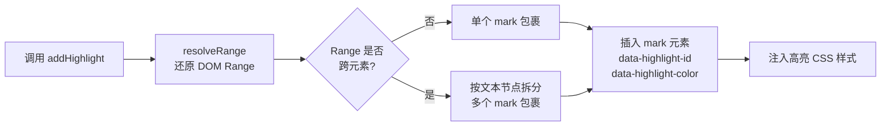
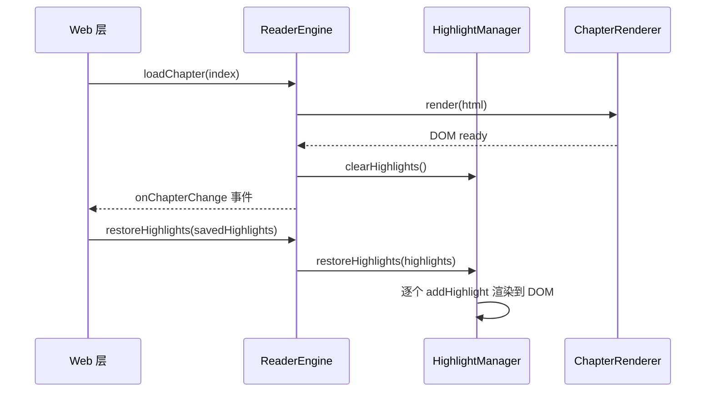
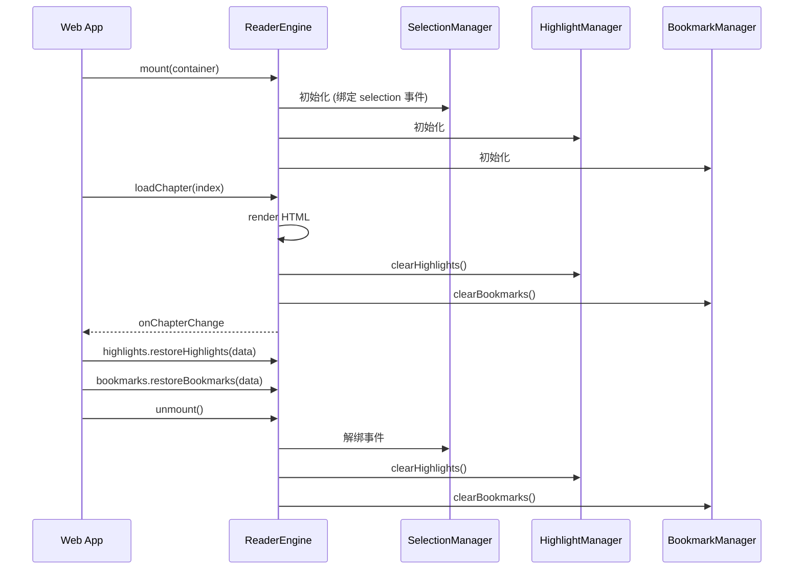
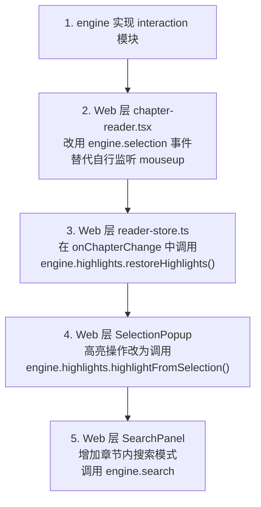

# 内容交互 API 设计文档

> reader-engine 层提供书签、高亮标注、搜索三大内容交互的核心 DOM 操作能力，Web 层负责 UI 展示和后端同步。

## 现状分析

### 当前架构



### 问题

- **书签**: engine 无位置标识能力，Web 层使用空字符串 `cfiRange: ''` 作为占位
- **高亮**: engine 无 DOM 标记/取消标记能力，Web 层仅在 store 中保存数据，不渲染到 DOM
- **搜索**: engine 无章节内文本搜索能力，Web 层完全依赖后端 API，无法离线搜索或在已加载内容中搜索
- **文本选择**: engine 无 Selection 到位置标识的转换能力，Web 层的 `chapter-reader.tsx` 自行处理选择事件

## 目标架构



## 模块设计

### 新增目录结构

```
src/
  interaction/
    index.ts
    selection-manager.ts      # 文本选择 + 位置标识
    highlight-manager.ts      # 高亮 DOM 渲染
    bookmark-manager.ts       # 书签位置管理
    search-manager.ts         # 章节内文本搜索
    types.ts                  # 交互相关类型定义
```

## 一、位置标识系统

### 设计选择

不采用 EPUB CFI 标准（过于复杂且依赖 EPUB 结构），采用自定义的 **TextPosition** 方案，基于 DOM 路径 + 文本偏移量。

### TextPosition 数据结构

| 字段 | 类型 | 说明 |
|------|------|------|
| `chapterId` | `string` | 章节 ID |
| `path` | `number[]` | 从 contentElement 到目标节点的 DOM 子节点索引路径 |
| `offset` | `number` | 文本节点内的字符偏移量 |

### TextRange 数据结构

| 字段 | 类型 | 说明 |
|------|------|------|
| `chapterId` | `string` | 章节 ID |
| `start` | `{ path: number[]; offset: number }` | 起始位置 |
| `end` | `{ path: number[]; offset: number }` | 结束位置 |
| `text` | `string` | 选中的纯文本内容 |

### 序列化格式

TextPosition 序列化为字符串用于存储和传输，格式: `{chapterId}|{path.join('.')}|{offset}`

TextRange 序列化格式: `{chapterId}|{start.path.join('.')},{start.offset}|{end.path.join('.')},{end.offset}`

### 稳定性保障

DOM 路径在同一 HTML 内容下是确定性的，因为 `ChapterRenderer.render()` 对同一 HTML 始终生成相同的 DOM 树（DOMPurify 配置固定）。章节重新加载后可可靠地还原位置。

### SelectionManager API

| 方法 | 签名 | 说明 |
|------|------|------|
| `captureSelection` | `() => TextRange \| null` | 捕获当前浏览器 Selection，转换为 TextRange |
| `resolvePosition` | `(pos: TextPosition) => { node: Node; offset: number } \| null` | 将 TextPosition 还原为 DOM 节点 + 偏移量 |
| `resolveRange` | `(range: TextRange) => Range \| null` | 将 TextRange 还原为浏览器 Range 对象 |
| `scrollToPosition` | `(pos: TextPosition) => void` | 滚动/翻页到指定位置 |
| `serializePosition` | `(pos: TextPosition) => string` | 序列化为存储字符串 |
| `deserializePosition` | `(serialized: string) => TextPosition` | 反序列化 |
| `serializeRange` | `(range: TextRange) => string` | 序列化 TextRange |
| `deserializeRange` | `(serialized: string) => TextRange` | 反序列化 TextRange |

### 事件

| 事件名 | Payload | 说明 |
|--------|---------|------|
| `selectionchange` | `{ range: TextRange; rect: DOMRect } \| null` | 用户选择文本时触发，取消选择时 payload 为 null |

## 二、高亮 API (HighlightManager)

### 高亮颜色

| 颜色名 | 值 | 与 iOS/Web 对齐 |
|--------|-----|-----------------|
| `yellow` | `rgba(255, 235, 59, 0.35)` | 对齐 |
| `green` | `rgba(76, 175, 80, 0.35)` | 对齐 |
| `blue` | `rgba(66, 165, 245, 0.35)` | 对齐 |
| `pink` | `rgba(236, 64, 122, 0.35)` | 对齐 |
| `purple` | `rgba(171, 71, 188, 0.35)` | 对齐 |
| `orange` | `rgba(255, 152, 0, 0.35)` | 对齐 |

### HighlightData 类型

| 字段 | 类型 | 说明 |
|------|------|------|
| `id` | `string` | 高亮唯一标识 (由调用方提供) |
| `range` | `TextRange` | 高亮文本范围 |
| `color` | `HighlightColor` | 6 种颜色之一 |
| `note` | `string \| undefined` | 关联笔记 |

### DOM 渲染策略



**渲染方式**: 使用 `<mark>` 元素包裹高亮文本，通过 `data-highlight-id` 和 `data-highlight-color` 属性标识。

**跨元素处理**: 当高亮范围跨越多个 DOM 元素时，将 Range 按文本节点边界拆分为多个子范围，每个子范围独立包裹 `<mark>`，共享同一 `data-highlight-id`。

**样式注入**: 高亮样式通过 CSS 类注入到 `ChapterRenderer` 的 style 元素中，支持主题切换时自动调整透明度。

### HighlightManager API

| 方法 | 签名 | 说明 |
|------|------|------|
| `addHighlight` | `(data: HighlightData) => boolean` | 在 DOM 中渲染高亮，返回是否成功 |
| `removeHighlight` | `(id: string) => void` | 从 DOM 中移除高亮（取消 mark 包裹，合并文本节点） |
| `updateHighlightColor` | `(id: string, color: HighlightColor) => void` | 更新高亮颜色 |
| `getHighlight` | `(id: string) => HighlightData \| undefined` | 获取高亮数据 |
| `getAllHighlights` | `() => HighlightData[]` | 获取当前章节所有高亮 |
| `clearHighlights` | `() => void` | 清除当前章节所有高亮 DOM |
| `highlightFromSelection` | `(id: string, color: HighlightColor) => HighlightData \| null` | 从当前选择创建高亮（快捷方法） |
| `scrollToHighlight` | `(id: string) => void` | 滚动/翻页到高亮位置 |
| `restoreHighlights` | `(highlights: HighlightData[]) => void` | 章节加载后批量恢复高亮（从外部存储） |

### 事件

| 事件名 | Payload | 说明 |
|--------|---------|------|
| `highlightadd` | `HighlightData` | 高亮添加成功 |
| `highlightremove` | `{ id: string }` | 高亮被移除 |
| `highlighttap` | `{ id: string; rect: DOMRect }` | 用户点击已有高亮 |

### 章节切换生命周期



## 三、书签 API (BookmarkManager)

### BookmarkData 类型

| 字段 | 类型 | 说明 |
|------|------|------|
| `id` | `string` | 书签唯一标识 (由调用方提供) |
| `position` | `TextPosition` | 书签位置 |
| `label` | `string \| undefined` | 书签标题/描述 |

### BookmarkManager API

| 方法 | 签名 | 说明 |
|------|------|------|
| `addBookmark` | `(data: BookmarkData) => void` | 添加书签 |
| `removeBookmark` | `(id: string) => void` | 移除书签 |
| `getBookmark` | `(id: string) => BookmarkData \| undefined` | 获取书签 |
| `getAllBookmarks` | `() => BookmarkData[]` | 获取当前章节所有书签 |
| `clearBookmarks` | `() => void` | 清除当前章节所有书签 |
| `createBookmarkAtCurrentPosition` | `(id: string, label?: string) => BookmarkData` | 在当前阅读位置创建书签 |
| `scrollToBookmark` | `(id: string) => void` | 滚动/翻页到书签位置 |
| `restoreBookmarks` | `(bookmarks: BookmarkData[]) => void` | 章节加载后批量恢复书签 |

### 当前阅读位置计算

`createBookmarkAtCurrentPosition` 的位置计算逻辑:
- **分页模式**: 取当前页面可视区域中第一个文本节点的位置
- **滚动模式**: 取视口顶部可见的第一个文本节点的位置

### 事件

| 事件名 | Payload | 说明 |
|--------|---------|------|
| `bookmarkadd` | `BookmarkData` | 书签添加 |
| `bookmarkremove` | `{ id: string }` | 书签移除 |

### 设计说明

BookmarkManager 不负责 DOM 渲染（不在内容中显示书签图标），仅管理位置数据和导航。书签的视觉呈现（如顶部角标）由 Web 层 UI 组件负责。

## 四、搜索 API (SearchManager)

### 搜索模式

engine 层提供**章节内文本搜索**（在已加载/可加载的 HTML 内容中搜索），与 Web 层现有的后端全书搜索互补。

```mermaid
flowchart TB
    subgraph "Web 层 - 全书搜索"
        A[用户输入关键词] --> B[调用后端 API<br/>/books/:id/search]
        B --> C[返回跨章节结果<br/>SearchResult[]]
        C --> D[点击结果]
        D --> E[跳转到章节]
    end

    subgraph "reader-engine - 章节内搜索"
        E --> F[engine.search 方法]
        F --> G[遍历 DOM 文本节点]
        G --> H[返回 SearchMatch[]]
        H --> I[高亮匹配项<br/>mark 元素标记]
        I --> J[导航到上/下一个匹配]
    end
```

### SearchMatch 类型

| 字段 | 类型 | 说明 |
|------|------|------|
| `index` | `number` | 匹配序号 (0-based) |
| `range` | `TextRange` | 匹配文本范围 |
| `context` | `{ before: string; after: string }` | 上下文片段 |

### SearchManager API

| 方法 | 签名 | 说明 |
|------|------|------|
| `search` | `(query: string, options?: SearchOptions) => SearchMatch[]` | 在当前章节内搜索 |
| `highlightMatches` | `(matches: SearchMatch[]) => void` | 在 DOM 中高亮所有匹配项 |
| `clearSearchHighlights` | `() => void` | 清除搜索高亮 |
| `goToMatch` | `(index: number) => void` | 导航到指定匹配项并高亮聚焦 |
| `nextMatch` | `() => number` | 导航到下一个匹配项，返回当前索引 |
| `prevMatch` | `() => number` | 导航到上一个匹配项，返回当前索引 |
| `currentMatchIndex` | `number` (getter) | 当前聚焦的匹配项索引 |
| `totalMatches` | `number` (getter) | 总匹配数 |

### SearchOptions 类型

| 字段 | 类型 | 默认值 | 说明 |
|------|------|--------|------|
| `caseSensitive` | `boolean` | `false` | 是否区分大小写 |
| `wholeWord` | `boolean` | `false` | 是否全词匹配 |
| `contextLength` | `number` | `30` | 上下文截取长度(字符数) |

### 搜索高亮与标注高亮的区分

| 维度 | 搜索高亮 | 标注高亮 |
|------|---------|---------|
| CSS 类名 | `re-search-highlight` | `re-highlight` |
| 聚焦样式 | `re-search-highlight--active` | 无 |
| 生命周期 | 搜索关闭时清除 | 持久化至手动删除 |
| data 属性 | `data-search-index` | `data-highlight-id` |
| 背景色 | 固定黄色/橙色 | 6 色可选 |

### 事件

| 事件名 | Payload | 说明 |
|--------|---------|------|
| `searchcomplete` | `{ query: string; total: number }` | 搜索完成 |
| `searchnavigate` | `{ index: number; total: number }` | 导航到某个匹配项 |

## 五、ReaderEngine 门面 API 扩展

在 `ReaderEngine` 类上暴露的交互 API:

### 属性

| 属性 | 类型 | 说明 |
|------|------|------|
| `selection` | `SelectionManager` (readonly) | 文本选择管理器 |
| `highlights` | `HighlightManager` (readonly) | 高亮管理器 |
| `bookmarks` | `BookmarkManager` (readonly) | 书签管理器 |
| `search` | `SearchManager` (readonly) | 搜索管理器 |

### 回调扩展 (ReaderCallbacks)

| 回调 | 签名 | 说明 |
|------|------|------|
| `onSelectionChange` | `(range: TextRange \| null, rect: DOMRect \| null) => void` | 文本选择变化 |
| `onHighlightTap` | `(id: string, rect: DOMRect) => void` | 点击已有高亮 |
| `onSearchComplete` | `(query: string, total: number) => void` | 搜索完成 |

### 生命周期集成



## 六、Engine 层 vs Web 层职责边界

| 职责 | Engine 层 | Web 层 |
|------|-----------|--------|
| 文本选择检测 | SelectionManager 捕获并转换为 TextRange | 接收事件，显示 SelectionPopup |
| 高亮 DOM 渲染 | HighlightManager 在 DOM 中插入/移除 mark 元素 | 触发 addHighlight，管理高亮列表 UI |
| 高亮数据持久化 | 不负责 | zustand store + 后端 API 同步 |
| 书签位置计算 | BookmarkManager 计算 TextPosition | 触发 addBookmark，管理书签列表 UI |
| 书签数据持久化 | 不负责 | zustand store + 后端 API 同步 |
| 章节内搜索 | SearchManager 遍历 DOM 文本节点 | 触发搜索，显示搜索 UI |
| 全书搜索 | 不负责 | 后端 API (`/books/:id/search`) |
| 搜索结果导航 | SearchManager 翻页/滚动到匹配位置 | 显示上/下一个按钮 |
| 离线队列 | 不负责 | use-highlights.ts 离线队列 |

## 七、类型定义汇总

### 新增类型 (src/interaction/types.ts)

| 类型名 | 分类 | 说明 |
|--------|------|------|
| `TextPosition` | 位置 | 文档内单点位置标识 |
| `TextRange` | 位置 | 文档内范围标识 |
| `HighlightColor` | 高亮 | 6 色联合类型 |
| `HighlightData` | 高亮 | 高亮完整数据 |
| `BookmarkData` | 书签 | 书签完整数据 |
| `SearchMatch` | 搜索 | 搜索匹配项 |
| `SearchOptions` | 搜索 | 搜索选项 |
| `SelectionChangeEvent` | 事件 | 选择变化事件 payload |
| `HighlightTapEvent` | 事件 | 高亮点击事件 payload |

### 公开导出 (src/index.ts 新增)

| 导出项 | 类型 | 说明 |
|--------|------|------|
| `SelectionManager` | class | 文本选择管理器 |
| `HighlightManager` | class | 高亮管理器 |
| `BookmarkManager` | class | 书签管理器 |
| `SearchManager` | class | 搜索管理器 |
| `TextPosition` | type | 位置标识 |
| `TextRange` | type | 范围标识 |
| `HighlightColor` | type | 高亮颜色 |
| `HighlightData` | type | 高亮数据 |
| `BookmarkData` | type | 书签数据 |
| `SearchMatch` | type | 搜索匹配 |
| `SearchOptions` | type | 搜索选项 |

## 八、Web 层迁移路径

当前 Web 层的交互逻辑集中在 `chapter-reader.tsx`（文本选择）和 `reader-store.ts`（书签/高亮数据管理）。迁移步骤:



迁移后 Web 层代码将大幅简化: `chapter-reader.tsx` 中的 selection 监听、DOM 操作逻辑移入 engine，Web 层仅保留 UI 交互和后端同步职责。
