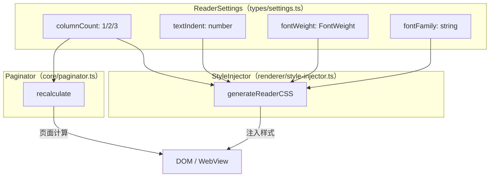
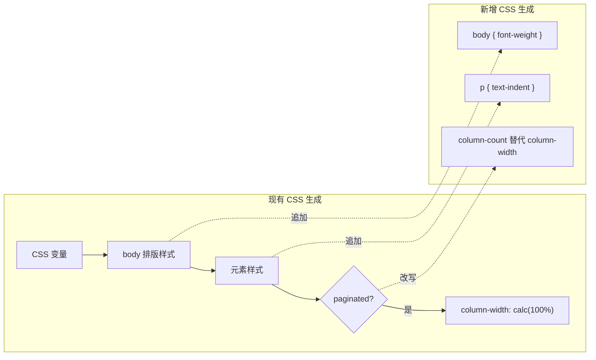
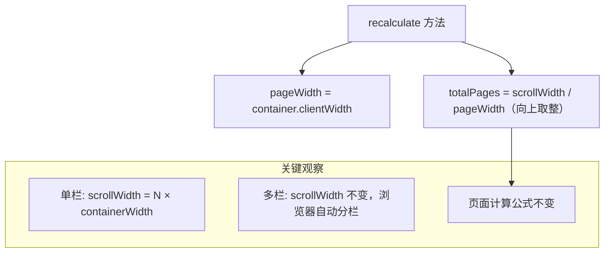
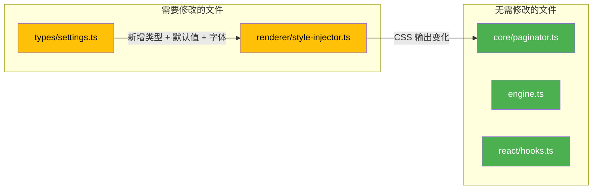

# 布局排版增强设计

> 对齐 iOS 基准端的排版能力，为 reader-engine 补齐多栏布局、首行缩进、字重控制、字体扩充四项功能。

## 一、功能范围

| 编号 | 功能 | iOS 现状 | engine 现状 | 目标 |
|------|------|----------|-------------|------|
| P0-2 | 宽屏多栏布局 | N/A（移动端单栏） | CSS columns 分页，栏数不可控 | 支持 1/2/3 栏切换，宽屏默认 3 栏 |
| P2-9 | 首行缩进 | CSS `text-indent: 2em` | 未实现 | 新增 `textIndent` 设置项 |
| P2-10 | 字重控制 | 5 档可调（300-700） | 未实现 | 新增 `fontWeight` 设置项 |
| P2-12 | 字体扩充 | 11 种 + 自定义导入 | 9 种（缺楷体、System Serif） | 扩充至 11 种，对齐 iOS |

## 二、整体架构

## 三、设置项变更

### 3.1 新增类型定义

| 类型/字段 | 定义 | 取值范围 | 默认值 | 说明 |
|-----------|------|----------|--------|------|
| `ColumnCount` | `1 \| 2 \| 3` | 1, 2, 3 | `1` | 栏数类型 |
| `FontWeight` | 联合类型 | `'light' \| 'regular' \| 'medium' \| 'semibold' \| 'bold'` | `'regular'` | 对齐 iOS `ReaderFontWeight` |
| `ReaderSettings.columnCount` | `ColumnCount` | 1-3 | `1` | 多栏布局栏数 |
| `ReaderSettings.textIndent` | `number` | 0-4 (em) | `0` | 首行缩进，单位 em |
| `ReaderSettings.fontWeight` | `FontWeight` | 见上 | `'regular'` | 正文字重 |

### 3.2 FontWeight 与 CSS 值映射

| FontWeight 值 | CSS `font-weight` | iOS 对应 | 显示名 |
|---------------|-------------------|----------|--------|
| `'light'` | `300` | `.light` | 细体 |
| `'regular'` | `400` | `.regular` | 常规 |
| `'medium'` | `500` | `.medium` | 中等 |
| `'semibold'` | `600` | `.semibold` | 半粗 |
| `'bold'` | `700` | `.bold` | 粗体 |

### 3.3 DEFAULT_SETTINGS 变更

新增以下默认值：

| 字段 | 默认值 | 理由 |
|------|--------|------|
| `columnCount` | `1` | 移动端兼容，宽屏由消费层按需切换 |
| `textIndent` | `0` | 英文默认无缩进，中文场景由消费层设为 2 |
| `fontWeight` | `'regular'` | 对齐 iOS 默认值 |

## 四、字体扩充

### 4.1 FONT_FAMILIES 对比与扩充

| 字体名 | 分类 | iOS | engine 现有 | 操作 |
|--------|------|-----|-------------|------|
| System | 无衬线 | ✅ | ✅ | 保留 |
| System Serif | 衬线 | ✅ | ❌ | **新增** |
| Georgia | 衬线 | ✅ | ✅ | 保留 |
| Palatino | 衬线 | ✅ | ✅ | 保留 |
| Times | 衬线 | ✅ | ✅ | 保留 |
| Baskerville | 衬线 | ✅ | ✅ | 保留 |
| Helvetica | 无衬线 | ✅ | ✅ | 保留 |
| Avenir | 无衬线 | ✅ | ✅ | 保留 |
| PingFang SC | 中文-无衬线 | ✅ | ✅ | 保留 |
| Songti SC | 中文-衬线 | ✅ | ✅ | 保留 |
| Kaiti SC | 中文-衬线 | ✅ | ❌ | **新增** |

### 4.2 新增字体 CSS 值

| 字体 | CSS `font-family` | 来源 |
|------|-------------------|------|
| System Serif | `ui-serif, Georgia, serif` | 对齐 iOS `cssValue` |
| Kaiti SC | `"Kaiti SC", "STKaiti", serif` | 对齐 iOS `cssValue` |

## 五、CSS 生成策略变更

### 5.1 generateReaderCSS 变更点

### 5.2 各功能的 CSS 变更

| 功能 | 影响选择器 | CSS 属性 | 取值逻辑 |
|------|-----------|----------|----------|
| 首行缩进 | `p` | `text-indent` | `${textIndent}em`，为 0 时不输出 |
| 字重 | `body, .reader-engine-content` | `font-weight` | FontWeight 映射的 CSS 数值 |
| 多栏布局 | `.reader-engine-content`（paginated 模式下） | `column-count` + `column-gap` | 见下文详细说明 |

### 5.3 多栏 CSS 策略

当前 paginated 模式使用 `column-width` 让浏览器自动决定栏数。改为使用 `column-count` 精确控制：

| 栏数 | CSS 输出 | 说明 |
|------|----------|------|
| 1 | `column-count: 1; column-gap: 0;` | 等效当前行为，单栏全宽 |
| 2 | `column-count: 2; column-gap: ${margin * 2}px;` | 双栏，栏间距为双倍 margin |
| 3 | `column-count: 3; column-gap: ${margin * 2}px;` | 三栏，适用于宽屏 |

移除现有的 `column-width: calc(100% - ...)` 写法，改为 `column-count` 固定栏数。`column-fill: auto` 和 `height: 100%; overflow: hidden;` 保持不变。

## 六、Paginator 调整

### 6.1 多栏下的页面计算

CSS `column-count` 由浏览器在固定高度容器内自动将内容排入多栏。每一「页」仍是 `containerWidth` 宽。因此：

| 项目 | 影响 | 说明 |
|------|------|------|
| `pageWidth` | 无变化 | 仍为 `container.clientWidth` |
| `totalPages` | 无变化 | `scrollWidth / pageWidth` 公式不变 |
| `applyTransform` | 无变化 | `translateX` 偏移量计算不变 |
| `PaginatorOptions` | 无变化 | 不需要感知栏数 |

多栏布局完全由 CSS 处理，Paginator 的页面计算逻辑**无需修改**。浏览器会在固定高度内将内容分配到指定栏数，溢出的内容自然形成下一「页」（即下一组 N 栏），`scrollWidth` 正确反映总宽度。

### 6.2 recalculate 时机

以下场景需触发 `recalculate()`：

| 触发场景 | 原因 |
|----------|------|
| `columnCount` 变更 | 栏数改变导致 scrollWidth 变化 |
| `textIndent` 变更 | 缩进增加可能导致内容回流 |
| `fontWeight` 变更 | 字重改变可能影响字形宽度 |
| `fontFamily` 变更 | 字体改变影响字形度量 |

这些场景复用现有的「设置变更 → 重新注入 CSS → recalculate」流程，无需新增机制。

## 七、影响范围汇总

| 文件 | 变更类型 | 详情 |
|------|----------|------|
| `src/types/settings.ts` | 修改 | 新增 `ColumnCount`、`FontWeight` 类型；`ReaderSettings` 新增 3 个字段；`DEFAULT_SETTINGS` 新增默认值；`FONT_FAMILIES` 新增 2 个字体 |
| `src/renderer/style-injector.ts` | 修改 | `generateReaderCSS` 追加 `font-weight`、`text-indent` 输出；paginated 分支改用 `column-count` |
| `src/core/paginator.ts` | 不修改 | 页面计算逻辑天然兼容多栏 |
| `src/engine.ts` | 不修改 | 已有设置变更 → CSS 重注入 → recalculate 流程 |

## 八、测试要点

| 测试项 | 验证内容 |
|--------|----------|
| 单栏分页 | columnCount=1 时行为与现有一致 |
| 多栏分页 | columnCount=2/3 时内容正确分栏，翻页正常 |
| 首行缩进 | textIndent=2 时段落首行缩进 2em |
| 缩进为 0 | textIndent=0 时无缩进，CSS 中不输出 text-indent |
| 字重切换 | 5 档字重在不同字体下正确渲染 |
| 新字体 | System Serif 和 Kaiti SC 正确加载和回退 |
| 设置变更 | 动态切换栏数/缩进/字重后页面正确重排 |
| 滚动模式 | 滚动模式下 columnCount 不生效 |
