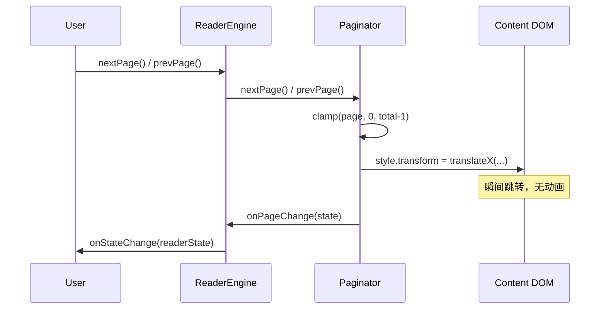
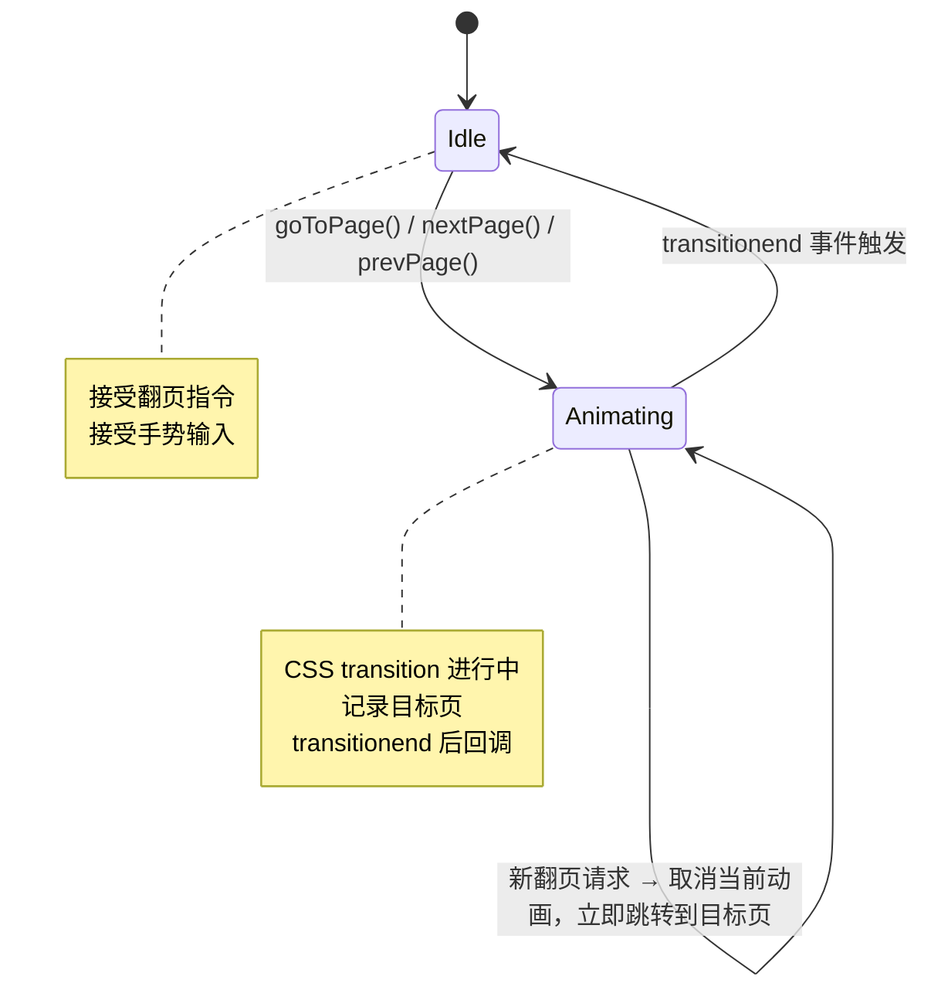
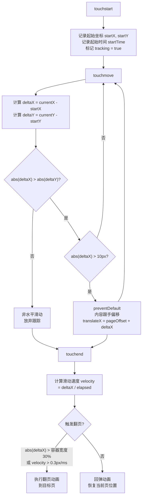
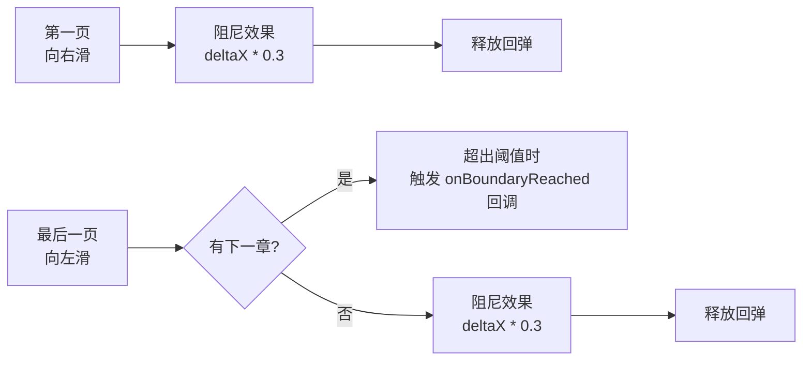
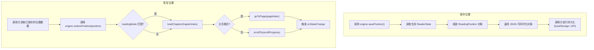
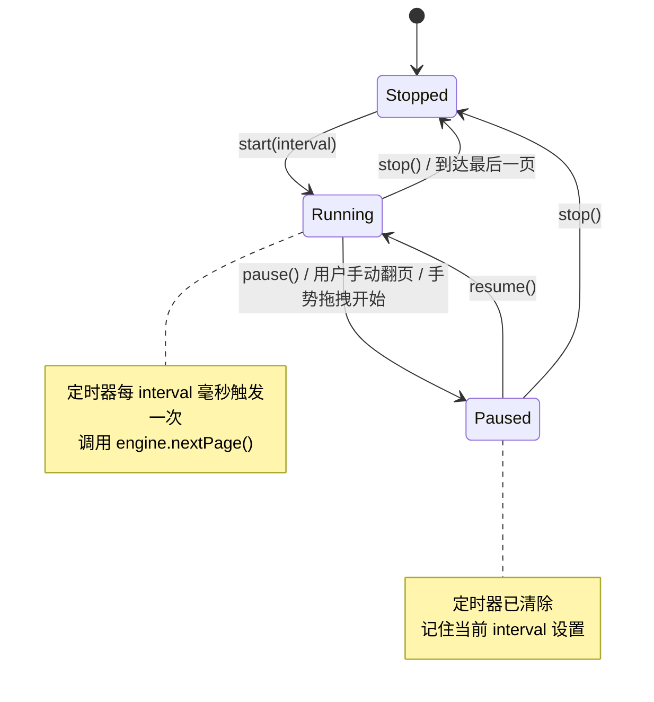
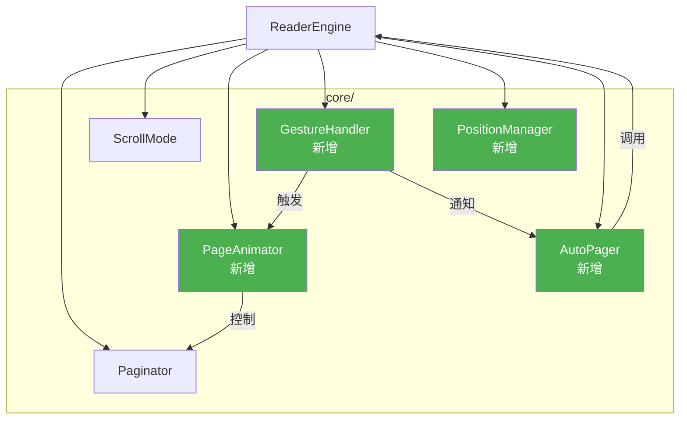
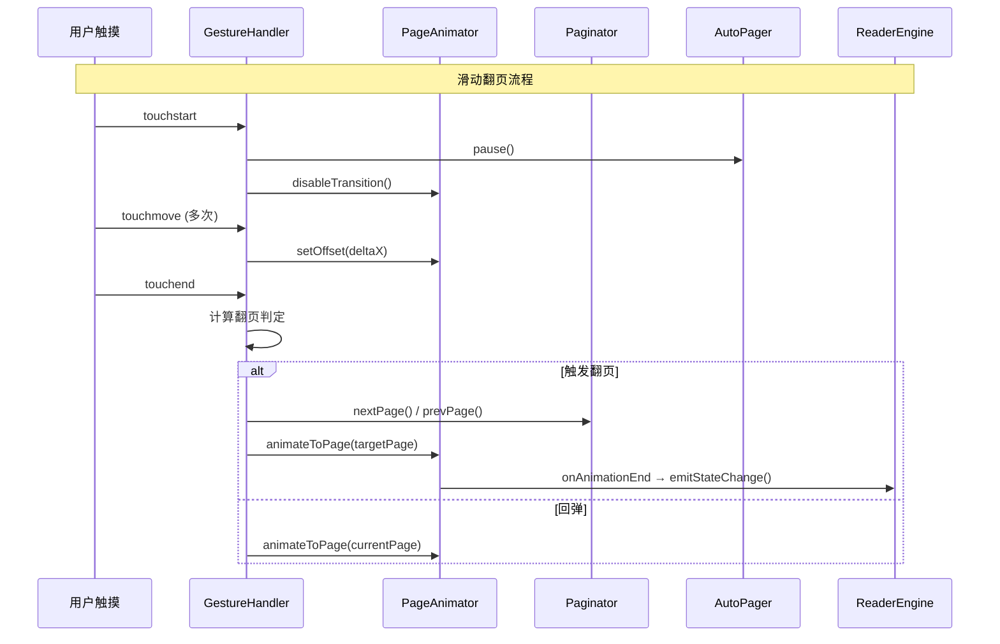

# Navigation Enhancement Design

> reader-engine 翻页导航增强设计文档，覆盖翻页动画、滑动手势、阅读位置恢复和自动翻页功能。

## 一、当前架构分析

### 现有翻页流程

### 当前问题

| 问题 | 现状 | 目标 |
|------|------|------|
| 翻页无动画 | `translateX` 瞬间切换 | CSS transition 平滑过渡 |
| 无手势支持 | 仅 `nextPage()`/`prevPage()` API 调用 | 触摸滑动 + 跟手拖拽 |
| 无位置恢复 | 重新加载后从第 0 页开始 | 序列化/反序列化阅读位置 |
| 无自动翻页 | 不存在 | 定时器驱动自动翻页 |

---

## 二、翻页动画 (P1-6)

### 动画类型

| 动画模式 | CSS 属性 | 时长 | 缓动函数 | 适用场景 |
|---------|----------|------|---------|---------|
| `slide` | `transform: translateX()` | 300ms | `cubic-bezier(0.25, 0.1, 0.25, 1)` | 默认，模拟左右翻页 |
| `fade` | `opacity` | 250ms | `ease-in-out` | 淡入淡出过渡 |
| `none` | 无 | 0ms | - | 无动画（当前行为，保持兼容） |

### 动画状态机

### CSS Transition 策略

| 阶段 | 操作 |
|------|------|
| 初始化 | 在 content 元素上设置 `transition: transform <duration> <easing>` |
| 触发翻页 | 更新 `translateX` 值，浏览器自动执行过渡动画 |
| 动画完成 | 监听 `transitionend` 事件，更新内部状态，触发回调 |
| 快速翻页 | 动画期间收到新翻页指令时，临时移除 transition，瞬间跳转到中间状态，再重新设置 transition 到最终目标 |
| fade 模式 | 先淡出(opacity: 0) -> 切换 translateX(无 transition) -> 淡入(opacity: 1) |

### 新增配置项

| 配置字段 | 类型 | 默认值 | 说明 |
|---------|------|--------|------|
| `pageTransition` | `'slide' \| 'fade' \| 'none'` | `'slide'` | 翻页动画模式 |
| `transitionDuration` | `number` | `300` | 动画时长(ms) |

---

## 三、滑动手势翻页 (P1-7)

### 手势处理流程

### 触摸事件参数

| 参数 | 说明 | 阈值 |
|------|------|------|
| `startX` / `startY` | touchstart 时的触摸坐标 | - |
| `deltaX` | 水平位移 (currentX - startX) | - |
| `directionLock` | 方向锁定标记 | 首次 move 时 `abs(deltaX) > abs(deltaY)` |
| `dragThreshold` | 最小拖拽距离，低于此值不视为拖拽 | 10px |
| `flipThreshold` | 触发翻页的最小滑动距离 | 容器宽度 30% |
| `velocityThreshold` | 触发翻页的最小速度 | 0.3 px/ms |
| `maxTrackDuration` | 超过此时间按距离判断而非速度 | 300ms |

### 手势与动画协作

| 阶段 | 行为 |
|------|------|
| 拖拽中 | 移除 CSS transition，内容跟手移动(实时更新 translateX) |
| 释放 - 翻页 | 恢复 CSS transition，translateX 动画到目标页偏移量 |
| 释放 - 回弹 | 恢复 CSS transition，translateX 动画回当前页偏移量 |
| 边界阻尼 | 在第一页向右滑或最后一页向左滑时，偏移量乘以 0.3 衰减系数 |

### 边界行为

### 新增配置项

| 配置字段 | 类型 | 默认值 | 说明 |
|---------|------|--------|------|
| `swipeEnabled` | `boolean` | `true` | 是否启用滑动手势 |

---

## 四、阅读位置恢复 (P1-8)

### 位置数据结构

| 字段 | 类型 | 说明 |
|------|------|------|
| `bookId` | `string` | 书籍 ID |
| `chapterId` | `string` | 章节 ID |
| `chapterIndex` | `number` | 章节索引(冗余，用于快速定位) |
| `pageIndex` | `number` | 页码(分页模式下) |
| `scrollProgress` | `number` | 滚动进度 0-1(滚动模式下) |
| `readingMode` | `ReadingMode` | 保存时的阅读模式 |
| `timestamp` | `number` | 保存时间戳(Unix ms) |
| `version` | `number` | 数据格式版本号，当前为 1 |

### 位置序列化/反序列化流程

### API 设计要点

| 方法 | 职责 | 说明 |
|------|------|------|
| `savePosition()` | 返回 `ReadingPosition` 对象 | 纯数据，不涉及持久化 |
| `restorePosition(pos)` | 异步恢复到指定位置 | 内部调用 `loadChapter` + `goToPage`/`scrollTo` |

**设计原则**：engine 只负责位置的序列化/反序列化和页面跳转，不负责持久化存储。持久化策略由调用方（Web/React 层）决定。

### 模式切换处理

| 场景 | 处理方式 |
|------|---------|
| 保存时分页模式，恢复时也是分页模式 | 直接使用 `pageIndex` |
| 保存时滚动模式，恢复时也是滚动模式 | 直接使用 `scrollProgress` |
| 保存时分页模式，恢复时改为滚动模式 | 由 `pageIndex` 估算 `scrollProgress = pageIndex / totalPages` |
| 保存时滚动模式，恢复时改为分页模式 | 由 `scrollProgress` 估算 `pageIndex = round(scrollProgress * totalPages)` |

---

## 五、自动翻页 (P3-13)

### 自动翻页状态机

### 预设间隔

| 间隔名称 | 毫秒值 | 对应 iOS 设置 |
|---------|--------|-------------|
| `fast` | 15000 | 15 秒 |
| `normal` | 30000 | 30 秒 |
| `slow` | 60000 | 60 秒 |

### 定时器管理策略

| 场景 | 行为 |
|------|------|
| 启动 | `setInterval(nextPage, interval)`，立即开始计时 |
| 用户手动翻页 | 暂停自动翻页，需要用户显式 `resume()` |
| 手势拖拽开始 | 暂停自动翻页 |
| 到达章节最后一页 | 触发章节切换，切换完成后继续自动翻页 |
| 到达全书最后一页 | 自动停止，状态变为 `Stopped` |
| 切换章节(手动) | 自动暂停 |
| 页面不可见(visibilitychange hidden) | 暂停定时器，避免后台消耗 |
| 页面恢复可见 | 恢复定时器 |
| `destroy()` | 清除定时器，释放事件监听 |

### 新增配置项

| 配置字段 | 类型 | 默认值 | 说明 |
|---------|------|--------|------|
| `autoPageInterval` | `number \| null` | `null` | 自动翻页间隔(ms)，null 表示关闭 |

---

## 六、模块架构

### 新增模块

### 模块职责

| 模块 | 文件 | 职责 |
|------|------|------|
| `PageAnimator` | `core/page-animator.ts` | 管理 CSS transition 生命周期，处理 slide/fade/none 模式切换 |
| `GestureHandler` | `core/gesture-handler.ts` | 触摸事件监听与解析，拖拽跟手、速度计算、方向锁定 |
| `PositionManager` | `core/position-manager.ts` | 位置序列化/反序列化，模式切换时的位置换算 |
| `AutoPager` | `core/auto-pager.ts` | 定时器管理，自动翻页状态机，可见性监听 |

### 模块交互时序

---

## 七、ReaderSettings 扩展

| 新增字段 | 类型 | 默认值 |
|---------|------|--------|
| `pageTransition` | `'slide' \| 'fade' \| 'none'` | `'slide'` |
| `transitionDuration` | `number` | `300` |
| `swipeEnabled` | `boolean` | `true` |
| `autoPageInterval` | `number \| null` | `null` |

---

## 八、ReaderEngine 新增 API

| 方法 | 返回类型 | 说明 |
|------|---------|------|
| `savePosition()` | `ReadingPosition` | 序列化当前阅读位置 |
| `restorePosition(pos: ReadingPosition)` | `Promise<void>` | 恢复到指定阅读位置 |
| `startAutoPage(interval?: number)` | `void` | 启动自动翻页 |
| `pauseAutoPage()` | `void` | 暂停自动翻页 |
| `resumeAutoPage()` | `void` | 恢复自动翻页 |
| `stopAutoPage()` | `void` | 停止自动翻页 |
| `autoPageState` (getter) | `'stopped' \| 'running' \| 'paused'` | 自动翻页状态 |

---

## 九、React Hook 扩展

| Hook | 提供内容 |
|------|---------|
| `useReader()` | 新增 `savePosition`, `restorePosition` |
| `useAutoPage()` (新增) | `start`, `pause`, `resume`, `stop`, `state`, `interval` |

---

## 十、兼容性与降级

| 场景 | 策略 |
|------|------|
| 不支持 touch 事件的浏览器 | GestureHandler 不绑定事件，不影响键盘/鼠标翻页 |
| CSS transition 不支持 | `transitionend` 事件不触发时，使用 setTimeout 兜底(duration + 50ms) |
| `prefers-reduced-motion` | 检测用户偏好，自动将 `pageTransition` 降级为 `none` |
| 滚动模式 | GestureHandler 和 PageAnimator 仅在分页模式下激活，滚动模式使用浏览器原生滚动 |
