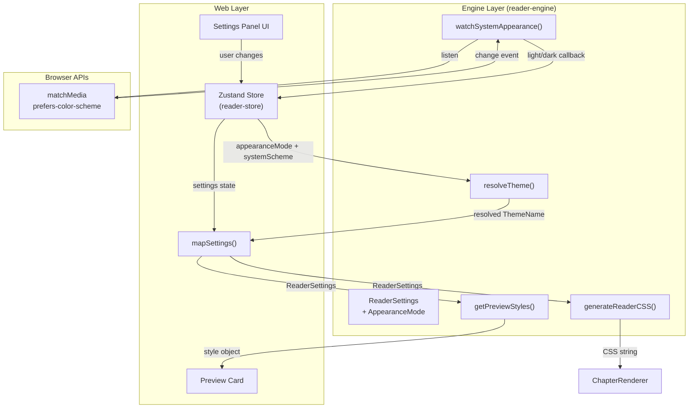
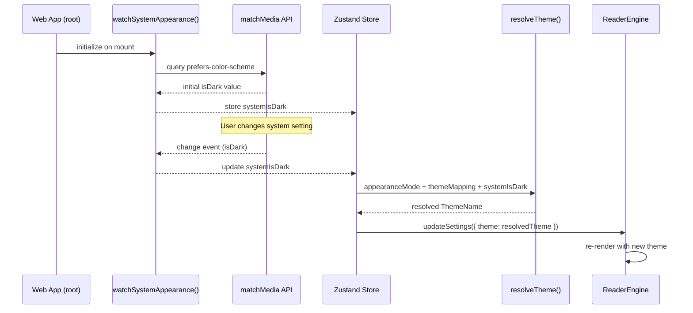

# Settings & Appearance Enhancement Design

## 1. Current State Analysis

### Engine Layer (`reader-engine`)

| Item | Current State |
|------|--------------|
| `ReaderSettings` interface | Defines `letterSpacing`, `wordSpacing`, `paragraphSpacing`, `textAlign`, `hyphenation` |
| `ThemeName` type | `'light' \| 'sepia' \| 'dark' \| 'ultraDark'` |
| `THEMES` constant | 4 themes with `background`, `text`, `secondaryText`, `highlight`, `link` colors |
| `generateReaderCSS()` | Applies all settings to CSS, including typography and theme colors |
| Appearance mode | Not supported -- no `auto` mode or system detection concept |

### Web Layer (`web`)

| Item | Current State | Problem |
|------|--------------|---------|
| `ReaderSettings` (web types) | Only has `fontSize`, `fontFamily`, `lineHeight`, `theme`, `marginSize` | Missing `letterSpacing`, `wordSpacing`, `paragraphSpacing`, `textAlign`, `hyphenation` |
| `mapSettings()` | Hardcodes `letterSpacing: 0`, `wordSpacing: 0`, `paragraphSpacing: 12`, `textAlign: 'justify'`, `hyphenation: true` | Users cannot adjust these values |
| Settings panel UI | Only exposes font size, line height, font family, theme, margin | No controls for letter/word/paragraph spacing, text align, hyphenation |
| Theme options | 3 themes: `light`, `sepia`, `dark` | No `ultraDark`, no `auto` mode |
| Preview | None | No live preview of current settings |

### iOS Layer (baseline reference)

| Feature | iOS Implementation |
|---------|-------------------|
| Quick typography | Text alignment picker + hyphenation toggle in main settings |
| Advanced typography | Letter spacing (-2~5), word spacing (0~10), paragraph spacing (0~30), font weight |
| Appearance mode | `AppearanceMode` enum: `system`, `light`, `dark` -- stored in UserDefaults |
| Theme picker | Full `ReaderTheme` set with visual color swatch buttons |
| Preview card | `PreviewCard` renders sample text with current theme, font, and font size |
| Reading mode | Paginated / scroll with advanced page turn settings |

## 2. Target Architecture

### 2.1 Layer Responsibilities

| Concern | Engine Layer | Web Layer |
|---------|-------------|-----------|
| Settings types & defaults | Define `ReaderSettings`, `ThemeName`, `AppearanceMode`, defaults | Define UI-level settings (simplified font family keys, margin size presets) |
| Theme resolution | Provide `resolveTheme()` to pick theme based on appearance mode + system preference | Call `resolveTheme()`, pass result to engine |
| CSS generation | `generateReaderCSS()` accepts `ReaderSettings` and renders all styles | Consume generated CSS |
| System appearance detection | Provide `AppearanceMode` type and `watchSystemAppearance()` utility | Wire listener to settings store |
| Preview styles | Provide `getPreviewStyles()` returning CSS properties object | Render preview card using returned styles |
| mapSettings adapter | N/A | Map UI-level settings to full `ReaderSettings` -- pass through user-controlled values instead of hardcoding |

### 2.2 Data Flow



## 3. Engine Layer Changes

### 3.1 New Type: `AppearanceMode`

| Value | Behavior |
|-------|----------|
| `'light'` | Always use the theme selected by the user (light/sepia) |
| `'dark'` | Always use the theme selected by the user (dark/ultraDark) |
| `'auto'` | Follow system `prefers-color-scheme`; map light system -> user's light theme, dark system -> user's dark theme |

`AppearanceMode` will be exported from `types/settings.ts` alongside existing types.

### 3.2 New Type: `ThemeMapping`

A pair of themes the user selects -- one for light system appearance, one for dark:

| Field | Type | Default |
|-------|------|---------|
| `lightTheme` | `ThemeName` | `'light'` |
| `darkTheme` | `ThemeName` | `'dark'` |

### 3.3 New Utility: `resolveTheme()`

Exported from a new file `src/appearance/resolve-theme.ts`.

**Input:** `appearanceMode`, `themeMapping`, `systemIsDark` (boolean)

**Output:** `ThemeName`

Resolution logic:

| AppearanceMode | systemIsDark | Result |
|---------------|-------------|--------|
| `'light'` | any | `themeMapping.lightTheme` |
| `'dark'` | any | `themeMapping.darkTheme` |
| `'auto'` | `false` | `themeMapping.lightTheme` |
| `'auto'` | `true` | `themeMapping.darkTheme` |

### 3.4 New Utility: `watchSystemAppearance()`

Exported from `src/appearance/watch-system-appearance.ts`.

**Behavior:**
- Uses `window.matchMedia('(prefers-color-scheme: dark)')` to detect current system scheme
- Returns initial value and registers a `change` event listener
- Returns a cleanup function to remove the listener
- SSR-safe: returns `false` (light) and no-op cleanup when `window` is unavailable

**Signature concept:**

| Parameter | Type | Description |
|-----------|------|-------------|
| `callback` | `(isDark: boolean) => void` | Called on system scheme change |
| **Returns** | `{ isDark: boolean; cleanup: () => void }` | Initial state + cleanup |

### 3.5 New Utility: `getPreviewStyles()`

Exported from `src/appearance/preview-styles.ts`.

**Input:** `ReaderSettings`

**Output:** A plain object of CSS property key-value pairs suitable for applying to a preview element:

| CSS Property | Source |
|-------------|--------|
| `backgroundColor` | Resolved theme background |
| `color` | Resolved theme text color |
| `fontFamily` | `settings.fontFamily` |
| `fontSize` | `settings.fontSize` (as px string) |
| `lineHeight` | `settings.lineHeight` |
| `letterSpacing` | `settings.letterSpacing` (as px string) |
| `wordSpacing` | `settings.wordSpacing` (as px string) |
| `textAlign` | `settings.textAlign` |

This is a lightweight alternative to full CSS generation for small preview cards.

### 3.6 Module Structure

New `src/appearance/` module:

```
src/appearance/
  resolve-theme.ts
  watch-system-appearance.ts
  preview-styles.ts
  index.ts
```

Exports added to `src/index.ts`.

### 3.7 Settings Type Changes

No changes to `ReaderSettings` interface itself -- it already contains all needed fields (`letterSpacing`, `wordSpacing`, `paragraphSpacing`, `textAlign`, `hyphenation`).

New exports from `types/settings.ts`:

| Export | Type |
|--------|------|
| `AppearanceMode` | `'light' \| 'dark' \| 'auto'` |
| `ThemeMapping` | `{ lightTheme: ThemeName; darkTheme: ThemeName }` |
| `DEFAULT_THEME_MAPPING` | `{ lightTheme: 'light', darkTheme: 'dark' }` |

## 4. Web Layer Changes (direction only)

### 4.1 Expand Web `ReaderSettings` Type

Add fields to the Web's `ReaderSettings` interface in `web/src/features/reader/types/index.ts`:

| New Field | Type | Default |
|-----------|------|---------|
| `letterSpacing` | `number` | `0` |
| `wordSpacing` | `number` | `0` |
| `paragraphSpacing` | `number` | `12` |
| `textAlign` | `'left' \| 'center' \| 'right' \| 'justify'` | `'justify'` |
| `hyphenation` | `boolean` | `true` |
| `appearanceMode` | `'light' \| 'dark' \| 'auto'` | `'auto'` |

### 4.2 Fix `mapSettings()` Hardcoding

The `mapSettings()` function in `chapter-reader.tsx` currently hardcodes five values. After the Web type expansion, it should pass through the user-controlled values from the store instead of using fixed constants.

**Before (current):**

| Field | Source |
|-------|--------|
| `letterSpacing` | Hardcoded `0` |
| `wordSpacing` | Hardcoded `0` |
| `paragraphSpacing` | Hardcoded `12` |
| `textAlign` | Hardcoded `'justify'` |
| `hyphenation` | Hardcoded `true` |

**After (target):**

| Field | Source |
|-------|--------|
| `letterSpacing` | `s.letterSpacing` |
| `wordSpacing` | `s.wordSpacing` |
| `paragraphSpacing` | `s.paragraphSpacing` |
| `textAlign` | `s.textAlign` |
| `hyphenation` | `s.hyphenation` |

### 4.3 Settings Panel UI Additions

New sections to add to `reader-settings-panel.tsx`:

| Section | Control Type | Range/Options |
|---------|-------------|---------------|
| Letter Spacing | Slider | -2 ~ 5, step 0.5 |
| Word Spacing | Slider | 0 ~ 10, step 1 |
| Paragraph Spacing | Slider | 0 ~ 30, step 2 |
| Text Alignment | Segmented buttons | left / center / right / justify |
| Hyphenation | Toggle | on / off |
| Appearance Mode | Segmented buttons | light / dark / auto |

Ranges match iOS `AdvancedReaderSettingsView` for cross-platform consistency.

### 4.4 System Appearance Wiring



The Web layer should:
1. Call `watchSystemAppearance()` once in a top-level effect (e.g., in the reader page layout)
2. Store `systemIsDark` in the Zustand store (non-persisted, runtime-only)
3. Derive the effective theme using `resolveTheme()` whenever `appearanceMode`, `themeMapping`, or `systemIsDark` changes
4. Pass the resolved `ThemeName` to the engine via `mapSettings()`

### 4.5 Preview Card

The Web settings panel should include a preview card at the bottom (similar to iOS `PreviewCard`):

| Aspect | Approach |
|--------|----------|
| Style source | `getPreviewStyles(currentSettings)` from engine |
| Content | Static sample text (book title + paragraph excerpt) |
| Update trigger | Re-render on any settings change via Zustand subscription |
| Position | Bottom of settings panel, always visible |

## 5. iOS Parity Matrix

| Feature | iOS | Engine (current) | Engine (after) | Web (after) |
|---------|-----|------------------|----------------|-------------|
| Font size | Slider | `fontSize` field | No change | Already exposed |
| Font family | Grid picker | `fontFamily` field | No change | Already exposed |
| Line height | Via LineSpacing enum | `lineHeight` field | No change | Already exposed |
| Letter spacing | Slider (-2~5) | `letterSpacing` field | No change | **New slider** |
| Word spacing | Slider (0~10) | `wordSpacing` field | No change | **New slider** |
| Paragraph spacing | Slider (0~30) | `paragraphSpacing` field | No change | **New slider** |
| Text alignment | Segmented | `textAlign` field | No change | **New segmented** |
| Hyphenation | Toggle | `hyphenation` field | No change | **New toggle** |
| Theme picker | Visual swatches | `ThemeName` + `THEMES` | No change | Already exposed (add ultraDark) |
| Appearance mode | system/light/dark | N/A | **New `AppearanceMode` type** | **New segmented** |
| Preview card | PreviewCard view | N/A | **New `getPreviewStyles()`** | **New preview component** |
| System detection | SwiftUI ColorScheme | N/A | **New `watchSystemAppearance()`** | **Wire to store** |

## 6. Implementation Order

| Step | Scope | Description |
|------|-------|-------------|
| 1 | Engine | Add `AppearanceMode`, `ThemeMapping` types and `DEFAULT_THEME_MAPPING` to `types/settings.ts` |
| 2 | Engine | Create `src/appearance/resolve-theme.ts` with `resolveTheme()` |
| 3 | Engine | Create `src/appearance/watch-system-appearance.ts` with `watchSystemAppearance()` |
| 4 | Engine | Create `src/appearance/preview-styles.ts` with `getPreviewStyles()` |
| 5 | Engine | Create `src/appearance/index.ts` barrel export, update `src/index.ts` |
| 6 | Engine | Add unit tests for all three utilities |
| 7 | Web | Expand Web `ReaderSettings` type with typography and appearance fields |
| 8 | Web | Update `reader-store.ts` defaults and add `systemIsDark` runtime state |
| 9 | Web | Fix `mapSettings()` to pass through all settings instead of hardcoding |
| 10 | Web | Wire `watchSystemAppearance()` in reader page layout |
| 11 | Web | Add typography controls (letter/word/paragraph spacing, alignment, hyphenation) to settings panel |
| 12 | Web | Add appearance mode control to settings panel |
| 13 | Web | Add preview card component using `getPreviewStyles()` |

## 7. Non-Goals

- Font weight control (iOS has it, but lower priority for Web)
- Screen brightness control (OS-level, not applicable to Web)
- Auto page settings (covered in navigation enhancement design)
- Tap zone configuration (covered in navigation enhancement design)
- Advanced page turn modes (covered in navigation enhancement design)
