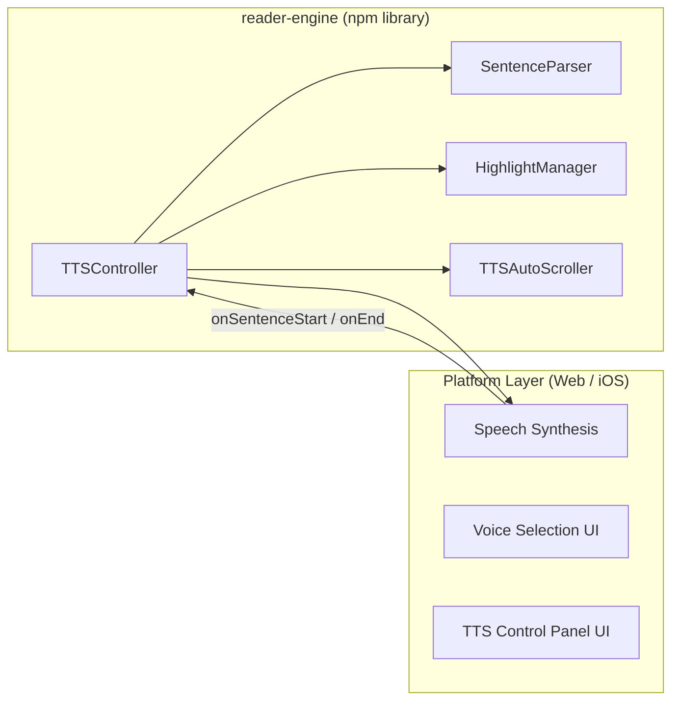
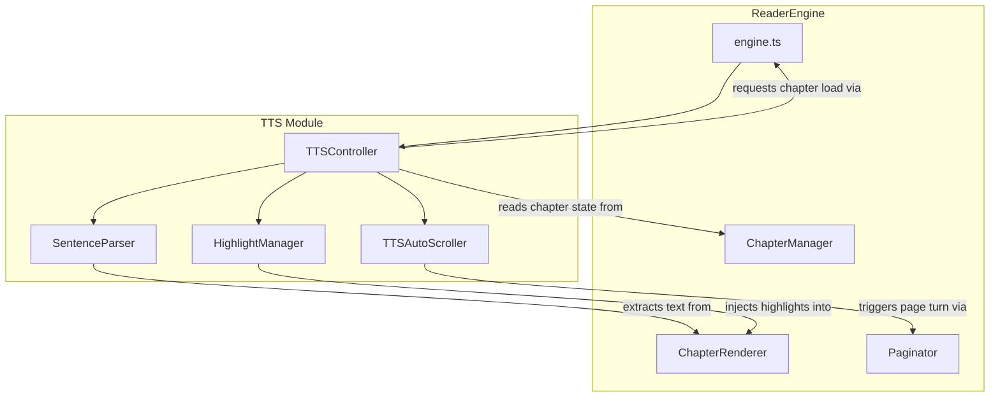
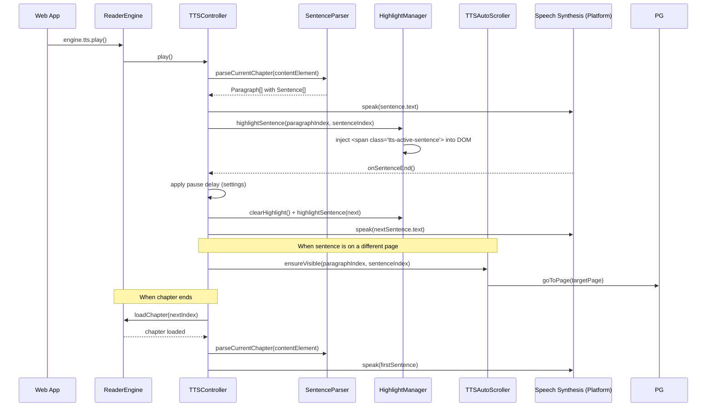
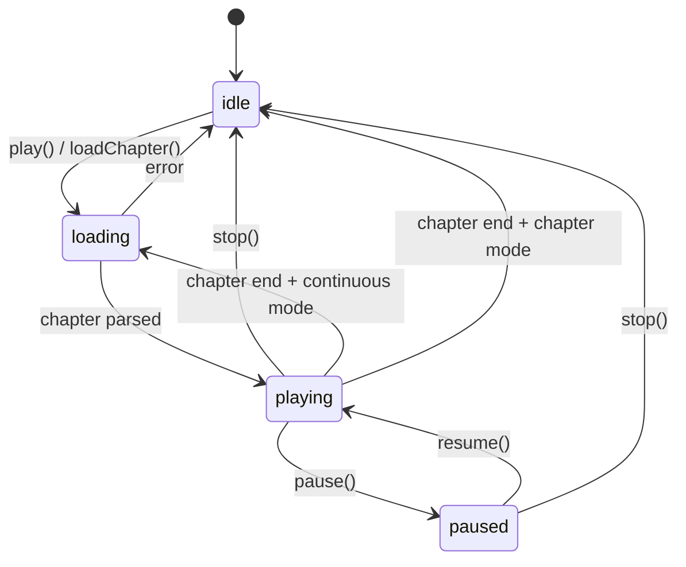
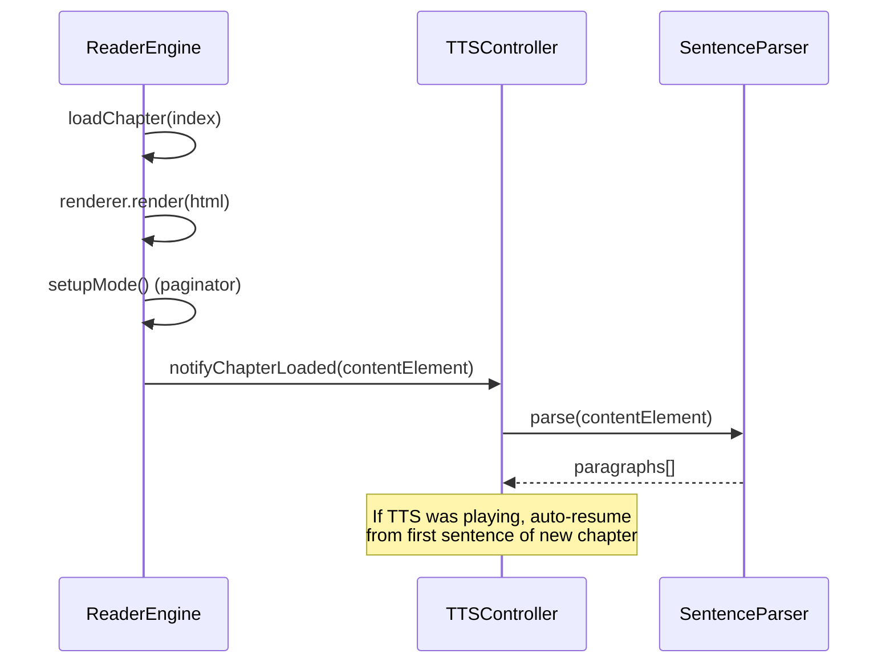

# TTS Module Design - reader-engine

> Date: 2026-02-17
> Status: Draft
> Priority: P0 (句子高亮跟随), P3 (停顿控制, 自动翻页)

## 1. Overview

reader-engine needs a TTS (Text-to-Speech) module that provides sentence-level highlight tracking, pause control between sentences/paragraphs, and automatic page turning. The engine layer handles **text extraction, sentence splitting, playback coordination, and highlight state management**. The actual speech synthesis remains in the platform layer (Web Speech API / native).

### Scope Boundary



## 2. Architecture

### 2.1 Module Structure

```
src/
  tts/
    tts-controller.ts       # Main orchestrator
    sentence-parser.ts       # Text extraction + sentence splitting
    highlight-manager.ts     # DOM highlight injection/removal
    index.ts                 # Public exports
```

### 2.2 Component Diagram



### 2.3 Data Flow



## 3. Type Definitions

### 3.1 TTSState

| Field | Type | Description |
|-------|------|-------------|
| status | `'idle' \| 'loading' \| 'playing' \| 'paused'` | Current playback status |
| currentParagraphIndex | `number` | Index of the paragraph being read |
| currentSentenceIndex | `number` | Index of the sentence within the current paragraph |
| globalSentenceIndex | `number` | Index across all sentences in the chapter |
| totalSentences | `number` | Total sentence count in current chapter |
| totalParagraphs | `number` | Total paragraph count in current chapter |
| currentSentenceText | `string \| null` | Text of the sentence currently being spoken |
| progress | `number` | 0-1, completion ratio for current chapter |

### 3.2 TTSSettings

| Field | Type | Default | Description |
|-------|------|---------|-------------|
| rate | `number` | 1 | Speech speed (0.1 - 10, mapped to platform range) |
| pitch | `number` | 1 | Speech pitch (0.5 - 2) |
| volume | `number` | 1 | Speech volume (0 - 1) |
| pauseBetweenSentences | `PauseLevel` | `'normal'` | Pause duration between sentences |
| pauseBetweenParagraphs | `PauseLevel` | `'normal'` | Pause duration between paragraphs |
| autoPageTurn | `boolean` | true | Auto-navigate to page containing current sentence |
| readingMode | `TTSReadingMode` | `'continuous'` | Whether to continue across chapters |

### 3.3 PauseLevel

| Value | Sentence Delay (ms) | Paragraph Delay (ms) |
|-------|---------------------|----------------------|
| `'short'` | 100 | 300 |
| `'normal'` | 300 | 800 |
| `'long'` | 600 | 1500 |

### 3.4 TTSReadingMode

| Value | Behavior |
|-------|----------|
| `'continuous'` | Auto-advance to next chapter when current chapter ends |
| `'chapter'` | Stop at chapter end |

### 3.5 TTSCallbacks

| Callback | Signature | Description |
|----------|-----------|-------------|
| onStateChange | `(state: TTSState) => void` | Fired on any state change |
| onSentenceChange | `(paragraphIndex: number, sentenceIndex: number, text: string) => void` | Fired when a new sentence starts being spoken |
| onParagraphChange | `(paragraphIndex: number) => void` | Fired when speaking moves to a new paragraph |
| onChapterEnd | `() => void` | Fired when all sentences in the chapter are spoken |
| onAutoPageTurn | `(page: number) => void` | Fired when auto-page-turn navigates to a new page |
| onError | `(error: Error) => void` | Fired on TTS errors |

### 3.6 SpeechSynthesisAdapter (Platform interface)

| Method | Signature | Description |
|--------|-----------|-------------|
| speak | `(text: string, options: SpeakOptions) => void` | Start speaking the given text |
| pause | `() => void` | Pause speech |
| resume | `() => void` | Resume speech |
| cancel | `() => void` | Stop and cancel speech |
| onEnd | `(callback: () => void) => void` | Register end-of-utterance callback |
| onError | `(callback: (error: Error) => void) => void` | Register error callback |

This interface allows reader-engine to remain platform-agnostic. The Web layer provides a `WebSpeechAdapter` implementing this interface using `SpeechSynthesisUtterance`. iOS/native can provide their own adapter.

### 3.7 Parsed Structures (Internal)

**Paragraph**

| Field | Type | Description |
|-------|------|-------------|
| index | `number` | Global paragraph index matching `data-global-paragraph-index` in DOM |
| text | `string` | Plain text content of the paragraph |
| sentences | `Sentence[]` | Ordered sentences within this paragraph |
| element | `HTMLElement` | Reference to the DOM paragraph element |

**Sentence**

| Field | Type | Description |
|-------|------|-------------|
| index | `number` | Index within the parent paragraph |
| text | `string` | Plain text of the sentence |
| globalIndex | `number` | Index across all sentences in the chapter |

## 4. Component Details

### 4.1 SentenceParser

Responsible for extracting text content from the rendered DOM and splitting it into paragraph + sentence structures.

**Extraction strategy:**
1. Query all elements with `data-global-paragraph-index` attribute from the content element
2. For each paragraph element, collect text content via `TreeWalker(SHOW_TEXT)`
3. Split combined text into sentences using `Intl.Segmenter` (primary) with regex fallback

**Sentence splitting:**
- Primary: `new Intl.Segmenter(lang, { granularity: 'sentence' })` -- handles Chinese, English, and mixed text correctly
- Fallback (older browsers): Regex split on `(?<=[.!?。！？])\s*`

**Re-parse trigger:**
- Called after each `ChapterRenderer.render()` completes
- Also called after `Paginator.recalculate()` if layout changes affect text content

### 4.2 HighlightManager

Manages DOM manipulation to visually highlight the current paragraph and sentence.

**Highlight approach (aligned with iOS):**
1. **Paragraph highlight**: Add CSS class `tts-active-paragraph` to the current paragraph element
2. **Sentence highlight**: Find the sentence text within the paragraph's text nodes, wrap the matching range in `<span class="tts-active-sentence">`
3. **Cleanup**: Before applying new highlight, remove all existing `.tts-active-sentence` spans by unwrapping them (replace span with its text content, then normalize parent)

**Text matching strategy (aligned with iOS):**
1. Collect all text nodes within the paragraph via `TreeWalker`
2. Build a character-to-node offset map
3. Try exact string match first
4. If no match, apply Unicode normalization (smart quotes to ASCII, collapse whitespace) and retry
5. Handle cross-node matches by wrapping each text node segment individually (in reverse order to preserve offsets)

**CSS injected by StyleInjector:**

The `tts-active-paragraph` and `tts-active-sentence` classes are styled via `generateReaderCSS()` using the current theme's highlight color.

### 4.3 TTSController

Central orchestrator that coordinates SentenceParser, HighlightManager, and the platform speech adapter.

**State machine:**



**Playback loop:**
1. Get current sentence from parsed data
2. Call `adapter.speak(sentence.text)`
3. Call `highlightManager.highlightSentence(paragraphIndex, sentenceIndex)`
4. Call `autoScroller.ensureVisible(paragraphIndex, sentenceIndex)` if autoPageTurn enabled
5. On adapter `onEnd`: wait for configured pause delay, advance to next sentence, repeat from step 1
6. On paragraph boundary: apply paragraph pause delay instead of sentence delay
7. On chapter end: fire `onChapterEnd`, if continuous mode, request next chapter load

### 4.4 TTSAutoScroller

Handles automatic page navigation when the TTS highlight moves to a sentence on a different page.

**Strategy:**
1. After highlight is applied, check if the highlighted element is visible within the viewport
2. In paginated mode: determine which page contains the element using `element.offsetLeft` relative to `content.scrollWidth / pageWidth`
3. If target page differs from current page, call `Paginator.goToPage(targetPage)`
4. In scroll mode: call `element.scrollIntoView({ behavior: 'smooth', block: 'center' })`

## 5. Integration with ReaderEngine

### 5.1 Engine API Surface

TTSController is exposed through `ReaderEngine` as a `tts` property.

**Methods added to ReaderEngine:**

| Method | Description |
|--------|-------------|
| `tts.play(fromParagraph?)` | Start TTS from beginning or specified paragraph |
| `tts.pause()` | Pause playback |
| `tts.resume()` | Resume playback |
| `tts.stop()` | Stop and reset |
| `tts.togglePlayPause()` | Toggle between play and pause |
| `tts.nextSentence()` | Skip to next sentence |
| `tts.previousSentence()` | Skip to previous sentence |
| `tts.nextParagraph()` | Skip to next paragraph |
| `tts.previousParagraph()` | Skip to previous paragraph |
| `tts.goToParagraph(index)` | Jump to a specific paragraph |
| `tts.setRate(rate)` | Change speech rate (restarts current sentence) |
| `tts.updateSettings(partial)` | Update TTS settings |
| `tts.state` | Get current TTSState (readonly) |
| `tts.settings` | Get current TTSSettings (readonly) |

**Callbacks added to ReaderCallbacks:**

| Callback | Description |
|----------|-------------|
| `onTTSStateChange` | TTSState changed |
| `onTTSSentenceChange` | New sentence started |
| `onTTSParagraphChange` | New paragraph started |
| `onTTSChapterEnd` | Chapter finished |
| `onTTSAutoPageTurn` | Auto page turn triggered |

### 5.2 Initialization

TTSController is lazily created when `tts` property is first accessed. It requires:
- A `SpeechSynthesisAdapter` provided during construction or via `engine.tts.setAdapter(adapter)`
- Access to `ChapterRenderer.contentElement` for text extraction
- Access to `Paginator` for auto page turn
- Access to `ChapterManager` for chapter navigation

### 5.3 Chapter Lifecycle



When `loadChapter()` completes, ReaderEngine notifies TTSController. If TTS was in `playing` state, it automatically starts speaking the new chapter's first sentence.

### 5.4 Settings Integration

TTS settings are stored separately from `ReaderSettings` to keep the existing settings interface clean:

| Location | Contents |
|----------|----------|
| `ReaderSettings` | Existing: fontSize, theme, readingMode, etc. (unchanged) |
| `TTSSettings` | New: rate, pitch, volume, pause levels, autoPageTurn, readingMode |

TTSSettings persistence is handled by the consumer (Web layer stores in localStorage, same pattern as iOS UserDefaults).

## 6. React Wrapper

### 6.1 New Hook: useTTS

| Return Field | Type | Description |
|-------------|------|-------------|
| state | `TTSState` | Reactive TTS state |
| settings | `TTSSettings` | Current settings |
| play | `(fromParagraph?: number) => void` | Start playback |
| pause | `() => void` | Pause |
| resume | `() => void` | Resume |
| stop | `() => void` | Stop |
| togglePlayPause | `() => void` | Toggle |
| nextSentence | `() => void` | Next sentence |
| previousSentence | `() => void` | Previous sentence |
| nextParagraph | `() => void` | Next paragraph |
| previousParagraph | `() => void` | Previous paragraph |
| goToParagraph | `(index: number) => void` | Jump to paragraph |
| updateSettings | `(partial: Partial<TTSSettings>) => void` | Update settings |
| setAdapter | `(adapter: SpeechSynthesisAdapter) => void` | Set speech adapter |

The hook internally subscribes to TTSController callbacks and maps them to React state updates.

## 7. Web Layer Responsibilities

The following remain in the Web project (not in reader-engine):

| Responsibility | Reason |
|---------------|--------|
| `WebSpeechAdapter` implementation | Uses browser-specific `SpeechSynthesisUtterance` API |
| Voice list management & UI | Browser-specific `speechSynthesis.getVoices()` |
| TTS control panel UI | Application-specific UI component |
| Settings persistence (localStorage) | Application-specific storage |
| Sleep timer | Application-specific feature |

## 8. Feature Priority Mapping

### P0-1: Sentence Highlight Tracking

| Component | What it does |
|-----------|-------------|
| SentenceParser | Extracts paragraphs + sentences from rendered DOM |
| HighlightManager | Injects/removes highlight spans in DOM |
| TTSController | Coordinates parse -> speak -> highlight loop |
| useTTS hook | Exposes reactive state for React |

### P3-14: Pause Control

| Component | What it does |
|-----------|-------------|
| TTSSettings.pauseBetweenSentences | Short/Normal/Long pause levels |
| TTSSettings.pauseBetweenParagraphs | Short/Normal/Long pause levels |
| TTSController | Applies delay via `setTimeout` between utterances |

### P3-15: Auto Page Turn

| Component | What it does |
|-----------|-------------|
| TTSAutoScroller | Checks element visibility, triggers page navigation |
| TTSSettings.autoPageTurn | Enable/disable toggle |
| Integration with Paginator | Uses `Paginator.goToPage()` for paginated mode |
| Integration with ScrollMode | Uses `scrollIntoView()` for scroll mode |

## 9. Migration Path from Web's Existing TTS

The current Web `use-tts.ts` hook handles both speech synthesis and state management in a single hook. The migration:

| Current (Web-only) | New (reader-engine) | Web Layer |
|--------------------|--------------------|-----------|
| `splitIntoSentences()` | `SentenceParser` (DOM-aware, Intl.Segmenter) | - |
| `speakSentence()` / `speakNextSentence()` | `TTSController` playback loop | `WebSpeechAdapter` |
| `state` (React state) | `TTSController.state` -> `useTTS()` hook | - |
| `settings` (React state + localStorage) | `TTSSettings` type definition | localStorage persistence |
| No highlight | `HighlightManager` | - |
| No auto page turn | `TTSAutoScroller` | - |
| No pause control | `TTSController` pause delays | - |

The Web project replaces its `use-tts.ts` with `useTTS()` from reader-engine's React wrapper, plus a thin `WebSpeechAdapter`.

## 10. iOS Feature Parity Reference

| iOS Feature | reader-engine Equivalent | Status |
|-------------|------------------------|--------|
| Paragraph-level highlight | `HighlightManager.highlightParagraph()` | Covered |
| Sentence-level highlight | `HighlightManager.highlightSentence()` | Covered (P0-1) |
| Word-level highlight | Not in scope | Deferred (requires word boundary events) |
| Pause between sentences | `TTSSettings.pauseBetweenSentences` | Covered (P3-14) |
| Pause between paragraphs | `TTSSettings.pauseBetweenParagraphs` | Covered (P3-14) |
| Auto page turn | `TTSAutoScroller` | Covered (P3-15) |
| Cross-chapter auto-advance | `TTSController` + `ReaderEngine.loadChapter()` | Covered |
| Sleep timer | Web layer | Not in engine scope |
| Cloud TTS | Web layer | Not in engine scope |
| Lock screen controls | Web layer (Media Session API) | Not in engine scope |
| Position persistence | Web layer | Not in engine scope |
